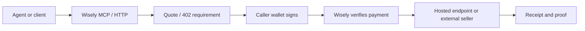

# Architecture

Wisely is an agent-payment infrastructure layer.

The public flow is:

1. Agent discovers a tool through MCP, a manifest, a hosted endpoint catalog, or an external x402 seller.
2. Agent asks Wisely for a quote or probes the resource with no payment.
3. Wisely returns an HTTP 402-style requirement or normalized handoff.
4. The buyer signs in their own wallet/runtime or uses an approved developer-credit key.
5. Wisely verifies the proof, invokes the service, and returns a receipt.
6. Reconciliation and proof endpoints let agents and operators verify what happened.

## Public Components

- `server.json` and `.well-known/mcp.json` for MCP discovery.
- `.well-known/x402.json` for payment surface discovery.
- `/ai/mcp` for remote MCP tools.
- `/ai/manifest` for agent-facing services.
- `/x402/rails/status` for live rail readiness.
- `/x402/proofs/cache` for public-safe proof.
- `/ai/endpoints` for hosted paid endpoint discovery.

## Private Components

The production server, signer custody, provider credentials, anti-abuse internals, private ledgers, and routing heuristics are private. This public repo shows how to integrate without exposing the business-critical internals.
